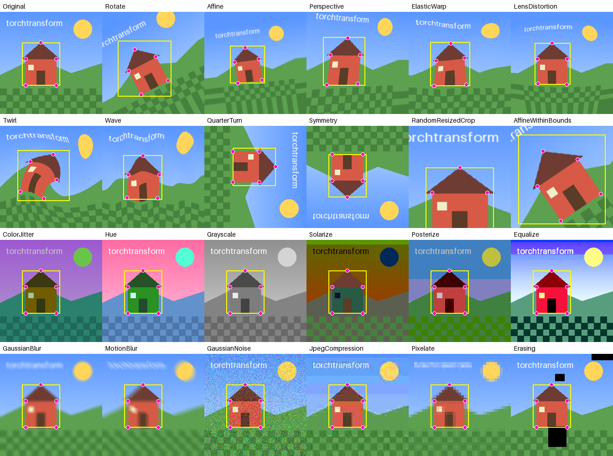
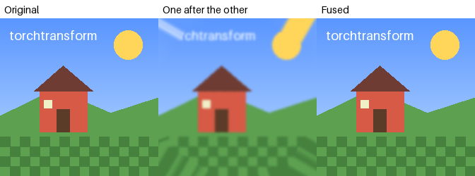
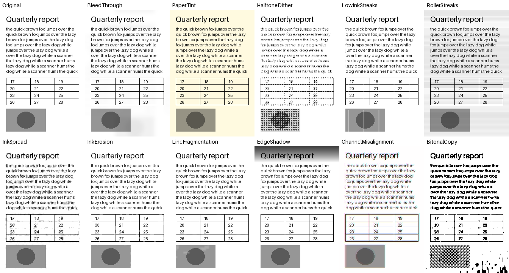

# torchtransform

**Fast, batched data augmentation for PyTorch that fuses every geometric transform of a pipeline into
a single resampling, and can invert what it did. Every batch element draws its own random parameters,
and images, masks, points and boxes are transformed together, in 2D and 3D.**

A typical augmentation pipeline rotates, scales, shears, warps and crops, one after the other, each
time resampling every pixel and blurring the image a little more. torchtransform resolves the whole
chain in **one** resampling of only the output pixels instead. And since it keeps the chain, it can
**undo** it: bring predictions on augmented images back onto the originals for test-time
augmentation, apply a transform in the frame of another, or replay the same geometry on labels
afterward.



## One resampling for the whole chain

Resampling after every transform is slow, and every resampling blurs. Here are six rotations and
scales that end where they started, applied one after the other and fused:



Any chain of affine, projective, warp, crop, pad and resize transforms, in any order and nested in
`Maybe`, `OneOf` and `SomeOf`, becomes a single `grid_sample`, evaluated only for the output pixels:

```python
augment = tt.Compose(
    tt.Rotate((-30, 30)),
    tt.Scale((0.8, 1.25)),
    tt.Maybe(tt.Perspective((0.0, 0.2)), p=0.5),
    tt.ElasticWarp(magnitude=(0, 6)),
    tt.HorizontalFlip(),
    tt.RandomCrop(224),  # Only the 224 by 224 output pixels are ever computed.
)
```

That is one resampling instead of six, and it is what makes the geometric pipeline of the
[benchmark](#performance) 7 times faster than the same transforms unfused on a GPU, and 57 and 70
times faster than kornia and torchvision. Matrices are multiplied, warps are evaluated on a coarse
grid and interpolated, and the elements of a batch that are only flipped, turned or moved by whole
pixels are gathered without any interpolation. Consecutive color transforms are fused the same way,
into one matrix per element and one pass over the pixels.

## Inverses and replays

Every geometric transform can be undone. Within a call, `Inverse` undoes exactly what a transform
drew for every element, so a transform can be applied in the frame of another:

```python
# Twirl around a random point: move it to the center, twirl, and move it back.
move = tt.Translate(x=(-0.3, 0.3), y=(-0.3, 0.3), relative=True)
twirl = tt.Compose(move, tt.Twirl(90, center=0.0), tt.Inverse(move))
```

And a call can return a `Replay` of its geometry, to apply to other data afterward, or to undo, such
as for test-time augmentation:

```python
augmented, replay = augment(images, replay=True)

# The same geometry on labels that were not at hand, resampled exactly as the images were.
labels = replay.apply(tt.Mask(masks))

# Predictions on the augmented images, brought back onto the original images in one resampling.
predictions = model(augmented)
restored = replay.inverse(tt.Mask(predictions, mode="bilinear"))
```

Undoing works for warps too (their inverse is exact or found numerically), and for crops, where what
lay outside the crop is filled by the padding.

## Features

- **Fused.** A whole chain of geometric transforms is one resampling of only the output pixels, and
  a run of color transforms one matrix per element.
- **Invertible.** `Inverse` within a call, and replays that apply or undo the geometry of a call
  afterward.
- **Exact where it can be.** Elements that are only flipped, turned by quarter turns, transposed or
  moved by whole pixels are gathered, not interpolated, so their pixels and labels come out bit for
  bit, even when other elements of the same batch are rotated.
- **Per element.** Every batch element draws its own parameters, and decides on its own whether a
  transform with a probability, or a branch of `OneOf` or `SomeOf`, applies to it, all in batched
  tensor operations, on the CPU or the GPU. Quarter turns included.
- **Everything moves together.** Images, masks (label maps keep their labels), points, polygons,
  boxes and rotated boxes, in any combination, with the geometry moved exactly (warps included) and
  cheaply, at float64 precision.
- **2D and 3D.** The geometric transforms, and most of the others, work on `(B, C, H, W)` images and
  `(B, C, D, H, W)` volumes alike.
- **Antialiased.** Shrinking by two or more samples from a mipmap level per element, so a random
  resized crop does not alias.
- **Complete.** Over 80 transforms: geometric, warps, crops and resizes, fused color transforms,
  blurs, noise, JPEG artifacts and other photometric transforms, and a set that simulates scanned
  and copied documents.
- **Extensible.** Write a new transform by giving a matrix, a warp, a color matrix or a pixel
  function, and it is fused, masked, inverted and moves geometry like the built-in ones.

## Installation

```bash
pip install torchtransform
```

Or the latest version from GitHub: `pip install git+https://github.com/gerbenvv/torchtransform`. The
only dependency is PyTorch.

## Quick start

```python
import torch
import torchtransform as tt

augment = tt.Compose(
    tt.Affine(rotation=15, scale=1.2, translation=0.05, shear=5),
    tt.Maybe(tt.ElasticWarp(magnitude=(0, 6)), p=0.3),
    tt.HorizontalFlip(),
    tt.RandomCrop((224, 224)),
    tt.ColorJitter(brightness=0.3, contrast=0.3, saturation=0.3, hue=0.05),
    tt.OneOf(tt.GaussianBlur((0.5, 1.5)), tt.JpegCompression((30, 90)), tt.Identity()),
)

images = torch.rand(32, 3, 256, 256, device="cuda")

# A plain tensor is an image.
augmented = augment(images)

# Any combination of targets, by name. The outputs come back in the same formats.
outputs = augment(
    image=images,
    mask=tt.Mask(masks, padding=255),  # Label maps of shape (B, 1, H, W), 255 where padded.
    keypoints=tt.Points(keypoints),  # A (B, N, 2) tensor, or a list of B (N_i, 2) tensors.
    boxes=tt.Boxes(boxes, format="xyxy", clip=True),  # A list of B (N_i, 4) tensors.
    seed=42,
)
```

The four geometric transforms above are resolved in a single resampling of the 224 by 224 output
pixels, and the color jitter in a single pass. Every element of the batch gets its own rotation,
flip, crop and jitter, and about a third of them are warped.

## Targets

| Target         | Data                                                  | Notes                                                                                                                         |
| -------------- | ----------------------------------------------------- | ----------------------------------------------------------------------------------------------------------------------------- |
| `Image`        | `(B, C, H, W)` or `(B, C, D, H, W)`, float or `uint8` | Geometric and photometric transforms. Values in `[0, 1]` (`uint8` in `[0, 255]`, given back as `uint8`). Bilinear by default. |
| `Mask`         | `(B, C, H, W)` or `(B, C, D, H, W)`, any dtype        | Geometric transforms only. Nearest by default, so labels stay labels; `mode="bilinear"` for soft masks, heat maps or depth.   |
| `Points`       | `(B, ..., n)`, or a list of `B` tensors `(..., n)`    | Keypoints, landmarks or polygons, in `(x, y[, z])` order.                                                                     |
| `Boxes`        | `(B, N, 2n)`, or a list of `B` tensors `(N_i, 2n)`    | Axis-aligned boxes in `"xyxy"`, `"xywh"` or `"cxcywh"` format, optionally clipped.                                            |
| `RotatedBoxes` | `(B, N, 5)`, or a list of `B` tensors `(N_i, 5)`      | `(c_x, c_y, w, h, angle)` in 2D.                                                                                              |

A plain tensor passed to a transform is an `Image`. Pass targets by position (the outputs come back in
the same order) or by name (they come back as a dictionary). Inputs are never changed in-place.

Raster targets take the interpolation `mode` (`"bilinear"`, `"nearest"` or `"bicubic"`), the
`padding` for what a transform uncovers (`"zeros"`, `"border"`, `"reflection"`, `"mean"`, `"median"`,
or a fill value, one or one per channel), and whether to `antialias`.

**Conventions.** Coordinates are in pixels, in `(x, y)` or `(x, y, z)` order, with the origin in the
corner of the first pixel, so the pixel at row `i` and column `j` has its center at `(j + 0.5, i + 0.5)`.
Angles are in degrees, and positive angles turn the x axis toward the y axis, which is clockwise on
screen, as y points down. Rotations, scales and shears are around the center of the canvas. Moved
boxes are the boxes around their moved outlines; `tt.box_visibility` and `tt.inside` help to drop
boxes and points that left the canvas, together with their labels.

## Transforms

Every parameter that is drawn at random takes a fixed number, a `(low, high)` tuple for a uniform
range, a list of choices, or a distribution (`tt.Uniform`, `tt.LogUniform`, `tt.IntUniform`,
`tt.Normal`, `tt.Choice`). Scales are drawn uniformly in the logarithm. Every transform takes a
probability `p`, drawn per element.

| Kind          | Transforms                                                                                                                                                                                                                                                                                                                   |
| ------------- | ---------------------------------------------------------------------------------------------------------------------------------------------------------------------------------------------------------------------------------------------------------------------------------------------------------------------------- |
| Composition   | `Compose`, `Maybe`, `OneOf` (with weights), `SomeOf` (a number or a range of them), `Inverse`, `Identity`, `Lambda`                                                                                                                                                                                                          |
| Geometric     | `Affine`, `Rotate` (around any axis in 3D), `RandomOrientation` (3D), `Scale`, `Translate`, `Shear`, `Perspective`, `Flip`, `HorizontalFlip`, `VerticalFlip`, `QuarterTurn`, `Transpose`, `Symmetry` (of the square or cube), `AffineWithinBounds` (keeps points and boxes on the canvas)                                    |
| Warps         | `ElasticWarp`, `GridDistortion`, `LensDistortion`, `Twirl`, `Wave`                                                                                                                                                                                                                                                           |
| Canvas        | `Crop`, `CenterCrop`, `RandomCrop`, `Pad`, `Resize` (stretch, contain or cover, or one side), `RandomResizedCrop`                                                                                                                                                                                                            |
| Color (fused) | `Brightness`, `Contrast`, `Saturation`, `Hue`, `ColorJitter`, `Grayscale`, `Invert`, `RGBShift`, `ChannelShuffle`, `ChannelDropout`, `Sepia`, `AutoContrast`, `Normalize`, `ColorMatrix`                                                                                                                                     |
| Photometric   | `Gamma`, `Solarize`, `Posterize`, `Equalize`, `Sharpen`, `GaussianBlur`, `MotionBlur`, `Defocus`, `GaussianNoise`, `PoissonNoise`, `SpeckleNoise`, `SaltAndPepperNoise`, `JpegCompression`, `Downscale`, `Pixelate`, `Erasing`, `Vignette`, `ChromaticAberration`, `BackgroundGradient`, `BackgroundIrregularities`, `Clamp` |
| Documents     | `BleedThrough`, `PaperTint`, `HalftoneDither`, `LowInkStreaks`, `RollerStreaks`, `InkSpread`, `InkErosion`, `LineFragmentation`, `EdgeShadow`, `ChannelMisalignment`, `BitonalCopy`                                                                                                                                          |

The document transforms simulate scanners, printers, faxes and photocopiers, and are designed to keep
a page legible: they fade ink and rules rather than erase them, so labels such as boxes and text stay
true.



## How it works

**Geometry.** Geometric transforms work in centered coordinates, in pixels with the origin in the
center of the canvas. A matrix transform adds a matrix of shape `(B, n + 1, n + 1)` to the chain, a
warp adds a function of coordinates, and a canvas transform (a crop, pad or resize) adds a matrix and
changes the shape of the canvas. When pixels are needed (by a photometric transform, or at the end),
consecutive matrices are multiplied and the chain becomes:

- an index gather, for the elements whose chain is a signed permutation with whole-pixel offsets,
- one `affine_grid` and `grid_sample`, for affine chains, or one projective grid,
- a warp grid, evaluated every few pixels (warps are smooth) and upsampled, for chains with warps.

Points and boxes move through the same chain, forward, in float64 and only once something needs
them. Warps without a closed-form inverse are inverted by fixed-point iteration.

**One map.** The chain is one map from the output canvas to the input, so the canvases in between do
not cut content off: `Compose(Scale(2), Scale(0.5))` is the identity, not a zoomed-in image with a
border, and a rotation after a crop fills its corners with the image around the crop where there is
one. Only what falls outside the input is padded.

**Color.** Transforms that are affine per pixel in color accumulate a matrix of shape
`(B, C + 1, C + 1)`, applied in one pass and clamped once at the end of the run rather than after
every transform. Contrast needs the mean of the image as it is at that point, which is exact from
the pending matrix without applying it.

**Order matters for speed.** A photometric transform between two geometric ones splits the chain in
two resamplings. Put the geometric transforms first, and crops early rather than late: photometric
transforms then work on the smaller output.

**Outputs can share memory with inputs.** Inputs are never changed, but a crop or a flip of the whole
batch can return a view of the input, and a call that does nothing returns the input itself. Clone
an output before changing it in-place.

**Strong warps move points approximately.** Points are moved through a warp without a closed-form
inverse by fixed-point iteration, which converges for any warp that moves nearby points by less than
their distance, as sensible augmentations do. Very strong elastic warps can fold, and then do not.

**The canvas is shared.** A batch is one tensor, so a canvas transform changes the canvas of the whole
batch. Elements it does not apply to, by its probability or by not being chosen, are left unscaled in
the center of the new canvas. A quarter turn of a canvas that is not square keeps the canvas, and
crops and pads the turned element; turn square canvases, or crop or resize to a square first.

## Randomness

Every transform has a seed, and its draws in a call depend only on its own seed and the seed of the
call, so they do not change when the rest of a pipeline does. The seed of a call is drawn from
torch's global generator unless it is given, so `torch.manual_seed` and data loader worker seeding
make calls reproducible. `transform.manual_seed(seed)` sets the seed of a transform.

Within one call, a transform that appears twice draws the same values both times, which is what
makes `Inverse` undo exactly what a transform did (see [Inverses and replays](#inverses-and-replays)).

## Writing transforms

Subclass the kind of transform you have, and it is fused, masked by its probability, inverted and
applied to all targets like the built-in ones. The `Context` gives the batch size, the number of
dimensions, the canvas and its size, generators to draw from (`context.sample(parameter)` draws a
parameter per element), and where the geometry currently is (`context.bounds()`, `context.points()`).

```python
import torch
import torchtransform as tt
from torchtransform import matrices


class Squash(tt.MatrixTransform):
    def __init__(self, factor: tt.distributions.Parameter = (0.5, 1.0), p: float = 1.0) -> None:
        """Squashes the height by a factor drawn per element."""

        super().__init__(p)

        self.factor = factor

    def get_matrices(self, context: tt.Context) -> torch.Tensor:
        scales = torch.ones(context.batch_size, context.ndim, dtype=torch.float64)
        scales[:, 1] = context.sample(self.factor)

        return matrices.scale(scales)


class Ripple(tt.WarpTransform):
    def get_parameters(self, context: tt.Context) -> dict[str, torch.Tensor]:
        return dict(amplitude=context.sample((1.0, 3.0)))

    def backward_coordinates(self, coordinates, parameters):
        amplitude = parameters["amplitude"].view(-1, *(1,) * (coordinates.ndim - 1))
        shift = torch.zeros_like(coordinates)
        shift[..., 1] = amplitude[..., 0] * torch.sin(coordinates[..., 0] / 8)

        return coordinates + shift


class Warmth(tt.ColorTransform):
    def get_color_matrices(self, context: tt.Context, image: tt.ColorView) -> torch.Tensor:
        matrix = torch.eye(4, dtype=torch.float64).repeat(context.batch_size, 1, 1)
        matrix[:, 0, 0] = context.sample((1.0, 1.1))
        matrix[:, 2, 2] = context.sample((0.9, 1.0))

        return matrix


class Scanlines(tt.PixelTransform):
    def get_parameters(self, context: tt.Context) -> dict[str, torch.Tensor]:
        return dict(strength=context.sample((0.1, 0.3)))

    def apply_image(self, image, parameters, context):
        strength = parameters["strength"].view(-1, 1, 1, 1)
        image[:, :, ::2] *= 1 - strength

        return image
```

`Ripple` only gives the backward map, from output coordinates to where they come from, which is what
pixels need; points are moved by inverting it numerically, unless it also gives
`forward_coordinates`. `tt.functional` holds the building blocks of the built-in transforms, such as
per-element Gaussian blurs, value noise, morphology and color space conversions.

## Performance

Median times per batch on a GTX 1060 (6 GB) and a 6-core CPU, by
[`benchmarks/benchmark.py`](benchmarks/benchmark.py). Every library gives every element its own
parameters: kornia batched, torchvision one sample at a time (its batched transforms draw one set of
parameters for the whole batch). "Unfused" is torchtransform resampling after every transform, as a
sequential library does. The fastest time of every pipeline on every device is in bold.

| Pipeline                                                           | Library                 |          CPU |         GPU |
| ------------------------------------------------------------------ | ----------------------- | -----------: | ----------: |
| Random resized crop, flip, color jitter; 64 × 3 × 512 × 512        | torchtransform          |     104.8 ms | **14.6 ms** |
|                                                                    | torchtransform, unfused |     132.3 ms |     22.3 ms |
|                                                                    | kornia                  |     285.6 ms |     34.4 ms |
|                                                                    | torchvision, per sample |  **95.6 ms** |     55.0 ms |
| Affine, perspective, elastic, crop, with masks; 32 × 3 × 512 × 512 | torchtransform          | **157.8 ms** | **28.5 ms** |
|                                                                    | torchtransform, unfused |     725.0 ms |    201.2 ms |
|                                                                    | kornia                  |    8585.8 ms |   1630.2 ms |
|                                                                    | torchvision, per sample |    2352.7 ms |   2003.0 ms |
| 3D rotation, scale, flips, elastic, crop, with masks; 4 × 1 × 96³  | torchtransform          |  **35.3 ms** |  **8.1 ms** |
|                                                                    | torchtransform, unfused |     404.3 ms |     54.0 ms |

On the GPU, the fused pipelines are 2 to 70 times faster than the others, and on the geometric one,
where every transform would otherwise resample, 7 times faster than the same transforms unfused. On
the CPU, torchvision is slightly faster for the classification pipeline, whose per-sample crop is
a view of the input.

## Development

```bash
pip install -e . && pip install pre-commit pillow

# Tests (on the GPU too, when there is one).
python -m unittest discover -s src -p "*_test.py" -t src

# Formatting and linting.
pre-commit run -a

# Benchmarks (with kornia and torchvision installed) and the gallery images.
python benchmarks/benchmark.py
python docs/make_gallery.py
```

torchtransform brings together two earlier implementations by the author: a transform engine that
fuses chains of matrices, warps and crops into one resampling, and a large collection of batched
augmentations, including the document transforms.

## Citation

If you use torchtransform in your work, please cite it:

> Gerben van Veenendaal. *torchtransform: fast, batched data augmentation for PyTorch.* Software,
> version 1.0.0, 2026. https://github.com/gerbenvv/torchtransform

```bibtex
@software{vanVeenendaal2026torchtransform,
    author  = {van Veenendaal, Gerben},
    title   = {torchtransform: Fast, Batched Data Augmentation for {PyTorch}},
    year    = {2026},
    version = {1.0.0},
    url     = {https://github.com/gerbenvv/torchtransform},
}
```

GitHub's "Cite this repository" button (from [`CITATION.cff`](CITATION.cff)) gives the same reference
in other formats.

## License

[BSD 3-Clause](LICENSE)
